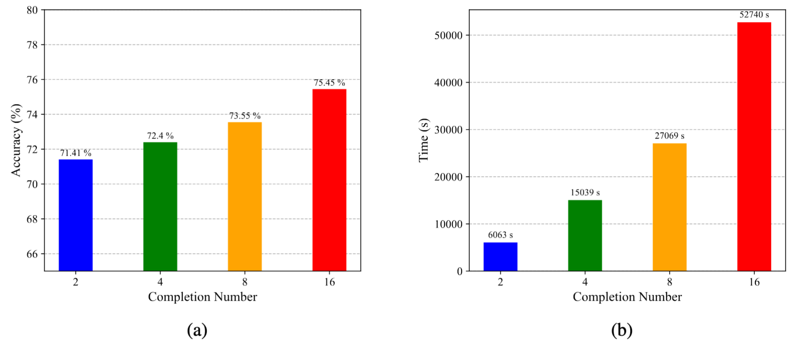
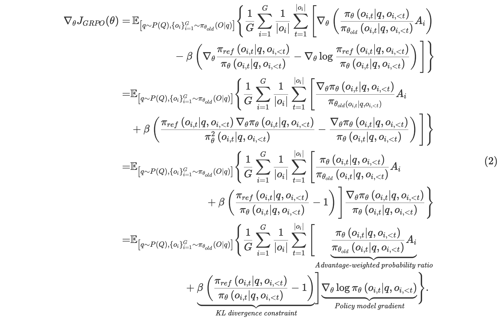
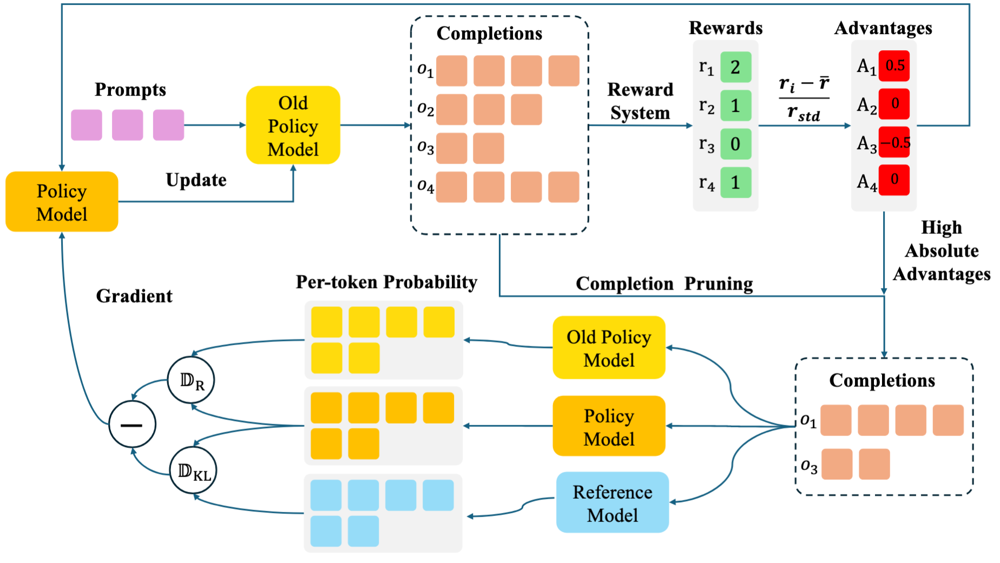

# CPPO: Accelerating the Training of Group Relative Policy Optimization-Based Reasoning Models


## Note: Our paper will be released within the next one to two weeks, accomplished by more comprehensive results.

## Abstract
We introduce **Completion Pruning Policy Optimization (CPPO)** to accelerate the training of reasoning models based on Group Relative Policy Optimization (GRPO). GRPO, while effective, incurs high training costs due to the need for sampling multiple completions for each question. Our analysis reveals that the number of completions impacts model accuracy sublinearly yet increases training time multiplicatively, and not all completions contribute equally to policy training---their contribution depends on their relative advantage. To address these issues, we propose CPPO, which prunes completions with low absolute advantages, significantly reducing the number needed for gradient calculation and updates. Additionally, we introduce a dynamic completion allocation strategy to maximize GPU utilization by incorporating additional questions, further enhancing training efficiency. Experiments on GSM8K datasets and Qwen2.5-1.5b-Instruct models demonstrate that CPPO accelerates reasoning model training by nearly **$$1.60 \times$$** while maintaining the same performance as the original GRPO.

## Motivation

GRPO's policy objective function:


The GRPO algorithm's training overhead scales linearly with the number of completions sampled per question. This is due to the need to compute predicted probabilities for the policy, reference, and old policy models across all completions. For instance, in DeepSeek-Math, using 64 completions requires 192 forward pass per question ($64 \times 3$), incurring significant computational costs. This raises two critical questions: 

**(1) How does the number of completions affect policy model accuracy? Does increasing completions always enhance performance?**



The number of completions impacts model accuracy **sublinearly** yet increases training time **multiplicatively**. Crucially, reducing completions to cut costs risks degrading reasoning capabilities, making it impractical.

**(2) Do all completions in a group contribute equally to training?**

**Not all completions contribute equally to policy training**---their contribution depends on their relative **advantage**.

The derivative of the GRPO's policy objective function in Eq.(1) with respect to the model parameters $\theta$ as:



 **(1) Advantage-weighted probability ratio term**  directly ties the contribution of each completion to its advantage. This term incentivizes the policy to prioritize actions with higher rewards, as the advantage function quantifies how much a given action improves expected returns relative to the baseline. By amplifying high-advantage completions and suppressing low-advantage ones, this term guides the policy optimization toward reward-aligned reasoning patterns.

**(2) KL divergence constraint term**  enforces stability by penalizing deviations from the reference model $\pi_{ref}$. However, this constraint is not inherently designed to shape the policy's reasoning patterns but rather ensures smooth updates during training.

**(3) Policy model gradient term** represents the gradient of the log-probability of the policy's predicted action with respect to the model parameters $\theta$.


Recent work by [Hu et al.](https://github.com/Open-Reasoner-Zero/Open-Reasoner-Zero,) demonstrates that removing the KL divergence constraint does not impair the trained model's reasoning ability, as the policy's core reasoning patterns are primarily driven by the reward-aligned advantage term. Motivated by this insight, we approximate the policy objective's derivative as:


effectively decoupling the optimization from KL regularization while retaining the reward-driven learning signal.


To better understand this formulation, we decompose the advantage-weighted probability ratio term into the **Probability ratio** term and the **Advantage** term. For a completion that significantly contribute to the policy update, all the new three components in Eq.(3) must be non-negligible. A  near-zero or zero value in any of these components would render the overall contribution minimal or nonexistent.

From a computational timing perspective, these components can be categorized as:
(1) the probability ratio and policy model gradient are post-forward information, meaning they can only be computed after the policy's forward pass.
(2) The advantage term, however, represents prior-forward information that can be calculated before the policy's forward computation.


Given our objective to accelerate GRPO training, we focus on leveraging this prior-forward information. By evaluating the advantage term before the forward pass, we can make an informed decision about whether to process a completion through the policy model. 


## Completions Pruning Policy Optimization



The pipeline of the CPPO algorithm is as follows:

(1) The old-policy model samples a group of completions for each question.
(2) The reward function computes the reward for each completion via :
$$r_i = R_{format}(o_i) + R_{accuracy}(o_i)$$,

where 

$$
\begin{aligned}
    R_{\text{format}}(o_i) &= 
    \begin{cases}
        1, & \text{if } o_i \text{ follows the correct format}, \\
        0, & \text{otherwise}.
    \end{cases} \\
    R_{\text{accuracy}}(o_i) &= 
    \begin{cases}
        2, & \text{if } o_i \text{ directly matchs the correct answer}, \\
        1.5 & \text{if } o_i \text{ matchs the correct answer after regular parsing}, \\
        0, & \text{otherwise}.
    \end{cases}
\end{aligned}
$$

(3) The relative advantage of each completion is calculated according to:

$$
A_i = \frac{r_i - \mathrm{mean}(\{r_1, r_2, \dots, r_G\})}
    {\mathrm{std}(\{r_1, r_2, \dots, r_G\})}. 
$$

(4) CPPO retains $$k = \lfloor G \times (1 - P)\rfloor$$ completions with highest absolute advantages, $P$ is pruning rate and $G$ is the compeletion number.

(5) The policy model is updated based on the selected completions.


## Parallel Processing through Dynamic Completion Allocation


A single device can process a maximum of $B$ question per batch, with each question generating $G$ candidate completions. After pruning, the total number of retained completions per device reduces to $B \times k$, resulting in suboptimal GPU utilization and underleveraged parallel computing capabilities.

To address this inefficiency, we dynamically allocate pruned completions from additional questions into the device's processing pipeline, as illustrated in the figure above. This strategy ensures that each device operates at full capacity by continuously populating its memory with high-quality completions derived from both the original and newly introduced questions. Critically, all newly incorporated completions undergo the same rigorous pruning process to maintain consistency and relevance.
## Key Results

| Model      | Method | Group Size |Pruning Rate | Accuracy | Time | Accelerate Ratio
| ----------- | ----------- |- |-|-|-|-|
| Qwen2.5-1.5B-Instruct      | -       |-|-|-|-|-
| Qwen2.5-1.5B-Instruct      | GRPO    |16 |0%| |   |
| Qwen2.5-1.5B-Instruct      | GRPO    | 8 |0% |  |   |
| Qwen2.5-1.5B-Instruct      | CPPO    |16 |50%|    |   |

**We will release more results about models of different scales and other datasets next week.**

## To Reproduce

### 1. Prepare the environment according to [Open R1](https://github.com/huggingface/open-r1).
```bash
conda create -n cppo python=3.11
conda activate cppo
pip install vllm==0.7.2
pip install setuptools
pip install flash-attn --no-build-isolation
pip install -e ".[dev]"
```
### 2. Training:
You need two GPU with 80G memory to reproduce our results.
#### GRPO
```bash
sh scripts/GRPO.sh
```
#### CPPO
```bash
sh scripts/CPPO.sh
```
### 3. Evaluation:
```bash
sh scripts/Eval.sh
```


## Acknowledgments
We are very grateful to the [Open R1](https://github.com/huggingface/open-r1) teams for createing awesome repo.
